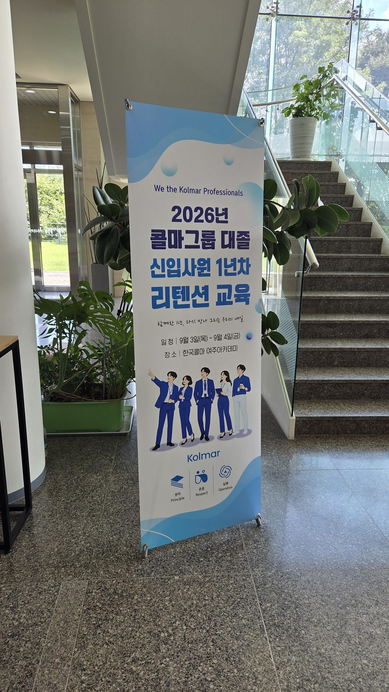
*한국콜마 여주아카데미 로비에 걸린 교육 배너. "함께한 1년, 다시 만나 그리는 우리의 내일"*

## 입사 1년, 가장 뜨거웠던 첫 마음은 어디로 갔을까

입사 1년 차는 조직 적응을 마친 시점입니다. 동시에 일의 의미를 다시 묻고, 미래를 저울질하며, **이탈 가능성이 가장 높아지는 시기**이기도 합니다.

첫 출근날의 긴장과 다짐은 익숙해진 업무와 반복되는 일상 속에서 조금씩 옅어집니다. 이 시점에 초심을 다시 꺼내보는 경험이 없다면, 1년의 성장은 자부심이 아니라 피로로만 남습니다.

2026년 9월 3일과 4일, 한국콜마 여주아카데미에서 **콜마그룹 대졸 신입사원 1년차 리텐션 교육 「초심 리스타트」**를 진행했습니다. JJ Creative 교육연구소의 전필국 소장과 민나라 소장이 2개 분반을 동시에 맡아, 3.5시간을 온전히 참여형으로 채웠습니다.

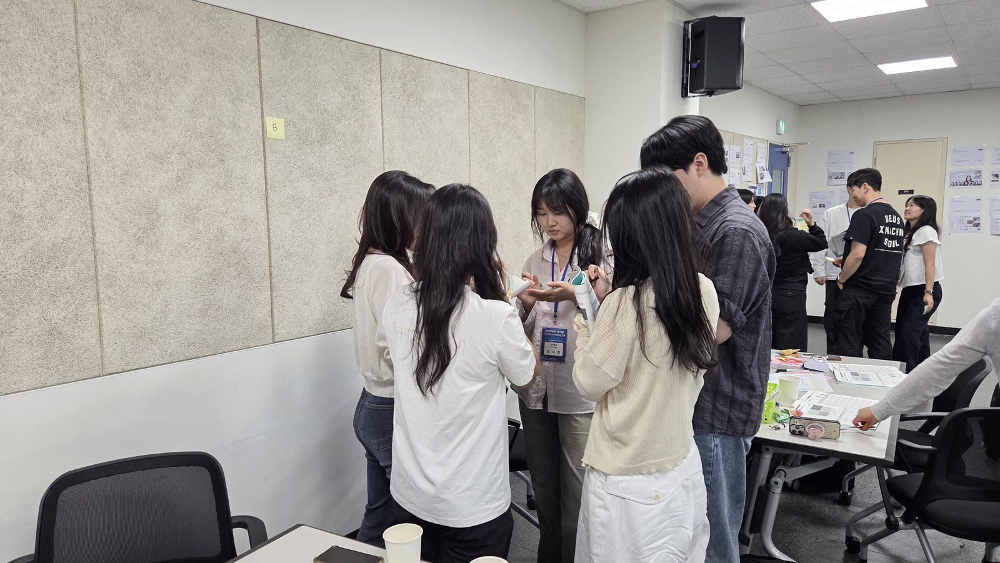
*강의는 최소화하고, 3.5시간 대부분을 참여자가 직접 움직이는 시간으로 설계했습니다.*

## 이런 고민에서 출발했습니다

- 1년 차 구성원의 이탈이 걱정되지만, 일방적인 동기부여 강의는 더 이상 통하지 않는다
- "요즘 어때?"라고 물어도 진짜 속마음은 잘 나오지 않는다
- 같은 기수 동기들이 부서로 흩어진 뒤, 서로 어떻게 지내는지 모른다
- 부서 간 협업이 필요할 때 먼저 손 내미는 사람이 없다

그래서 「초심 리스타트」는 **강의를 걷어내고 게임과 시뮬레이션으로 채웠습니다.** 방어하지 않고 자기 이야기를 꺼내게 만드는 것, 그것이 이 과정의 첫 번째 목표였습니다.

## 프로그램 구성 (3.5H)

| 모듈 | 내용 | 시간 |
| --- | --- | --- |
| **M1. Mindset Refresh** | 너도? 나도! 공감 게임 → 1년 전 나 / 앞으로의 나 성찰 → 초심 한 문장 선언 | 1.5H |
| **M2. Collective Intelligence** | 집단지성 인사이트 → 「생사초를 구하라」 시뮬레이션(팀 내 · 팀 간 소통) → 협업 복기 | 2.0H |

**교육 목표**

1. 입사 당시의 다짐과 지난 1년의 경험을 돌아보며 일과 조직에 대한 나만의 의미와 방향을 다시 정립한다.
2. 동기들과 생각을 나누며 서로의 고민과 성장을 확인하고, 심리적 안전감과 동기애를 회복한다.
3. 팀 내 소통과 팀 간 소통을 모두 요구하는 미션을 수행하며 집단지성의 성과를 체득한다.

## 1부. Mindset Refresh — "너도? 나도!"

1부는 **공감 게임**으로 문을 열었습니다. '나에게 일터란?', '1년 전 나는?', '앞으로의 나는?' 같은 제시어에 동기들이 동시에 답을 적고 한꺼번에 공개합니다. 같은 답이 나오면 공감 점수, 다른 답이 나오면 이야깃거리가 됩니다.

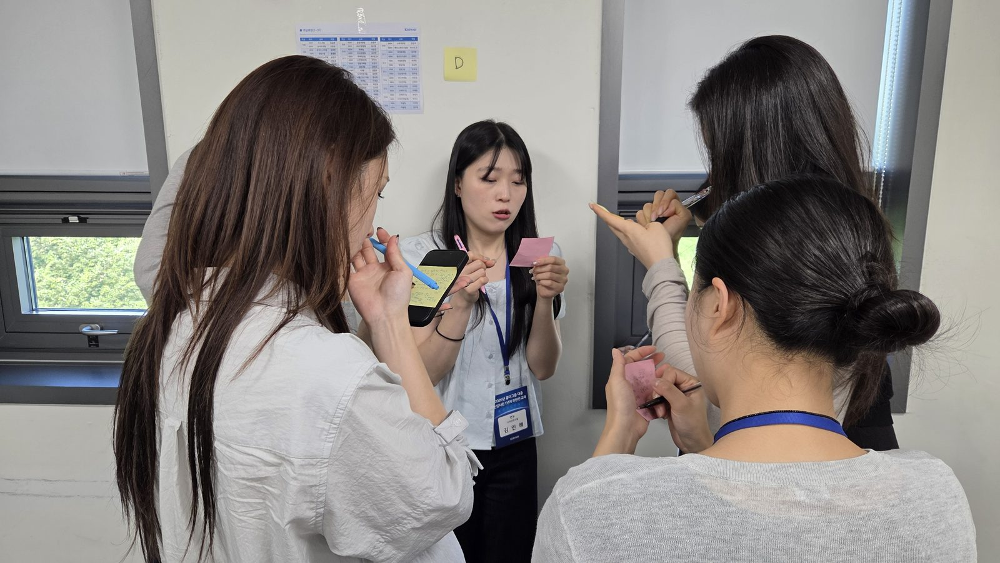
*제시어를 받고 각자 답을 적은 뒤, 동시에 공개하는 순간. "너도?" 하는 웃음이 터지면 어색함이 빠르게 풀립니다.*

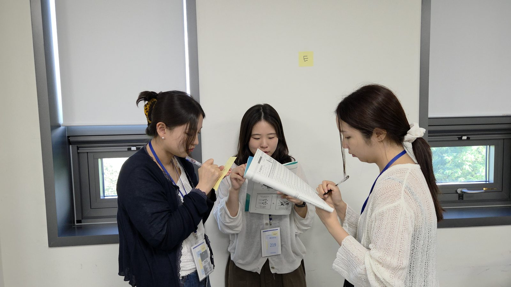
*벽면에 표시된 구역을 옮겨 다니며 매 라운드 새로운 동기와 짝을 이룹니다.*

이어진 활동에서는 **'함께 일하고 싶은 사람'의 조건**을 각자 포스트잇에 적고, 이를 K(지식)·S(스킬)·A(태도) 영역으로 분류해 벽면에 붙였습니다.

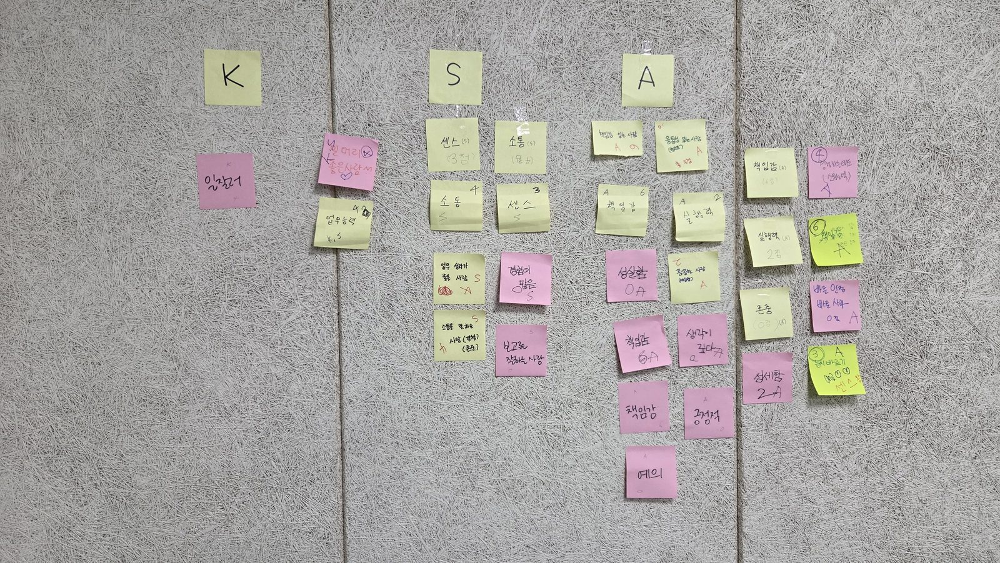
*결과는 압도적으로 A(태도) 쪽에 몰렸습니다. 책임감, 성실함, 존중, 예의, 소통, 센스…*

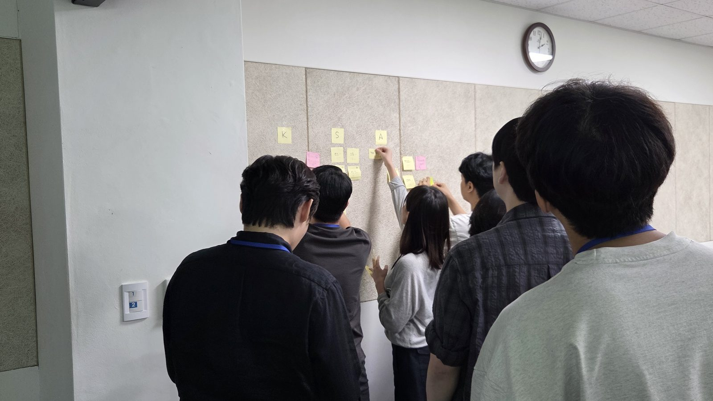
*"내가 함께 일하고 싶은 사람의 조건은, 곧 동료들이 나에게 기대하는 조건이기도 합니다."*

지식이나 스킬보다 태도에 표가 몰린다는 사실을 눈으로 확인하는 순간, 1년 차 구성원들의 표정이 달라집니다. 이때 **입사 당시 '1년 뒤 나에게 쓰는 편지'** 를 꺼냅니다.

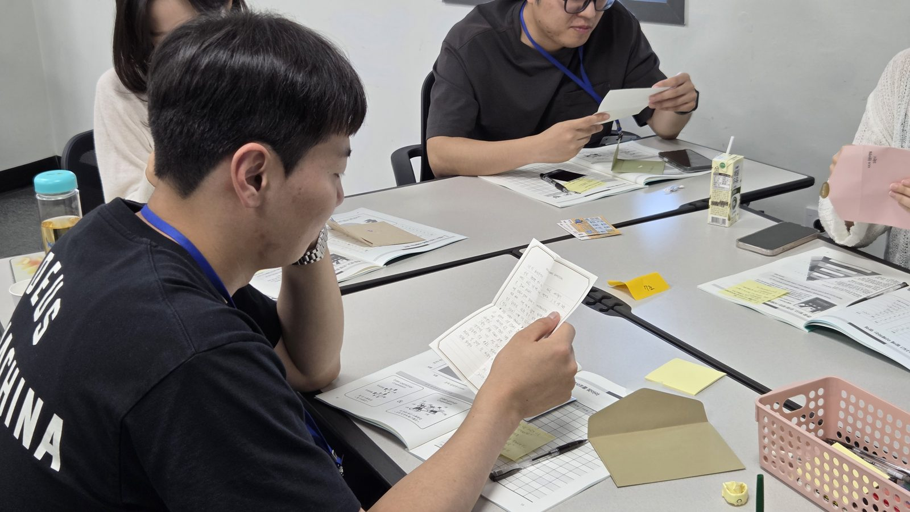
*1년 전의 내가 오늘의 나에게 보낸 편지. 강의장이 조용해지는 유일한 순간입니다.*

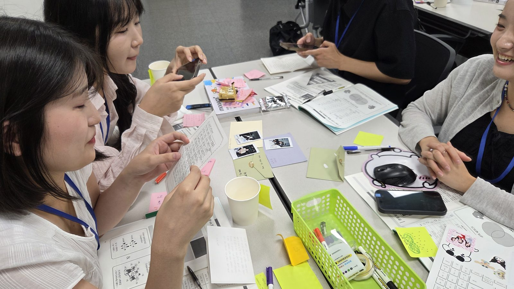
*"1년 전 나와 앞으로의 나를 나란히 적어보니, 생각보다 많이 성장했더라고요."*

1부는 오늘 되찾은 마음을 **한 문장**으로 정리하고 동기들 앞에서 선언하며 마무리했습니다.

## 2부. Collective Intelligence — "생사초를 구하라"

2부는 게이미피케이션 시뮬레이션입니다. 조원마다 서로 다른 단서를 받고, **오직 대화로만** 정보를 맞춰 신비의 약초 '생사초'를 찾아내야 합니다.

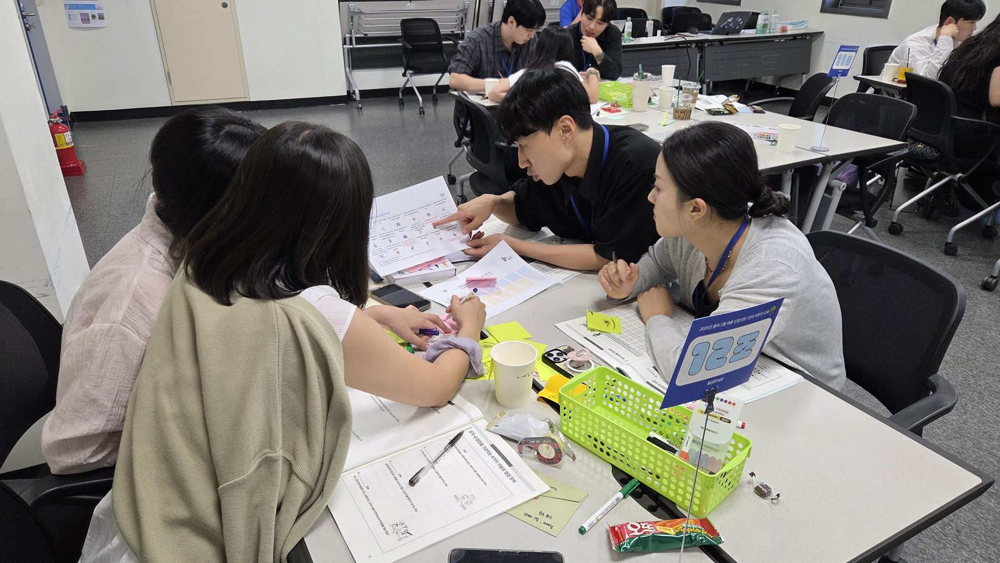
*1단계는 팀 내 소통. 내가 가진 단서를 정확히 설명하지 못하면 팀 전체가 막힙니다.*

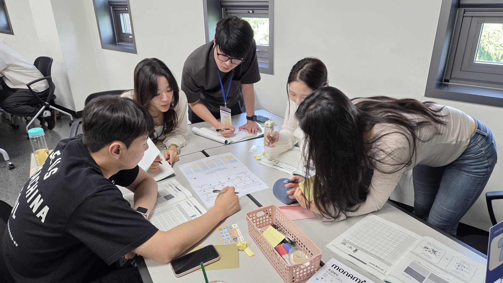
*"팀보다 똑똑한 개인은 없다" — 1인의 직관보다 여럿의 정보 결합이 더 빠른 답을 만듭니다.*

반전은 2단계입니다. **마지막 조각은 우리 팀에 없습니다.** 다른 팀과 정보와 자원을 교환해야만 미션이 풀리는 구조입니다. 내 팀의 성과만 지키려 하면 모두가 실패합니다.

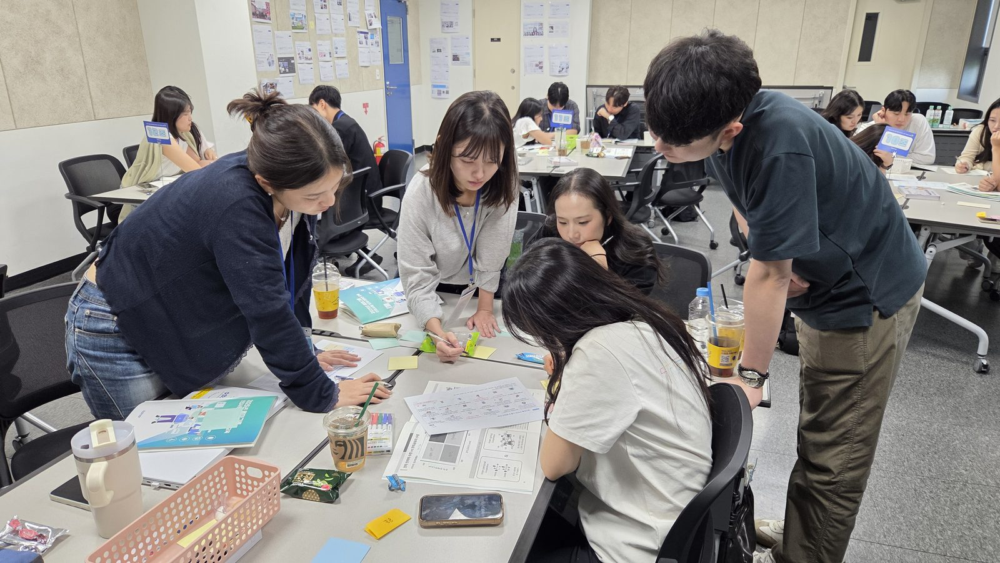
*자리에서 일어나 다른 팀을 찾아가는 협상 라운드. 이 순간 강의장의 온도가 가장 높아집니다.*

미션이 끝난 뒤에는 성공과 실패 요인을 함께 복기하고, 현업으로 돌아가서 실천할 협업 다짐을 나눴습니다.

## 참가자 후기

> "입사할 때 마음을 잊고 지냈다는 걸 알았어요. 오늘 다시 꺼내볼 수 있어서 좋았습니다."

> "생사초 미션에서 우리 팀만으로는 절대 못 푼다는 걸 알고 소름 돋았습니다."

> "강의를 듣는 게 아니라 계속 참여하니까 3시간 반이 정말 빨리 지나갔어요."

> "동기들도 저와 비슷한 고민을 하고 있었다는 게 가장 큰 위로였습니다."

> "다른 팀 동료들과 처음 제대로 이야기해봤어요. 이제 연락하기 편해졌습니다."

## 3.5시간이 남긴 것

**① 흐려졌던 일의 의미가 다시 선명해집니다.**
막연한 동기부여가 아니라 스스로 꺼낸 문장이기에, 현업에 돌아가서도 오래 남습니다.

**② 협업의 힘을 몸으로 배웁니다.**
우리 팀을 넘어야만 풀리는 미션을 함께 성공시킨 경험은, 부서 간 소통에 먼저 손 내미는 태도로 이어집니다.

**③ 흩어져 있던 동기들이 다시 네트워크로 묶입니다.**
'나만 그런 것이 아니었다'는 안도가 유대가 되고, 유대는 버틸 이유가 됩니다.

1년 차는 이탈의 시점이 될 수도, **조직에 뿌리내리는 전환점**이 될 수도 있습니다. 그 갈림길에서 한 번쯤 초심을 꺼내보는 자리를 만들어 주는 것 — 그것이 리텐션 교육의 역할이라고 생각합니다.

---

### 과정 문의

**JJ Creative 교육연구소** — 신입사원 입문 / 1·3년차 리텐션 / 팔로워십 / 소통협업 워크숍
게이미피케이션과 시뮬레이션 기반의 참여형 기업교육을 설계합니다.

<!--
────────────────────────────────────────────────
발행 전 체크리스트 (임시저장 상태 · 아직 게시 금지)
────────────────────────────────────────────────
[ ] 고객사(콜마그룹) 교육 사진 및 후기 대외 공개 승인 확인
[ ] 참가자 초상권 동의 확인 — 미동의 시 사진 교체 또는 모자이크 처리
[ ] 사진 속 명찰(이름) 및 조 편성표 개인정보 블러 처리 필요
    - 03-empathy-round-d.jpg : 명찰 이름, 벽면 조 편성표
    - 06-ksa-wall-share.jpg  : 명찰 이름
[ ] 참가자 후기는 제안서 수록 문구 기준 — 실제 현장 설문 문구로 교체 검토
[ ] 참가 인원 수 / 분반 수 등 실제 운영 수치 확인 후 본문 보강
[ ] 대표 이미지(썸네일) 최종 선정
[ ] 발행 시 frontmatter의 status: draft → published 로 변경
-->
